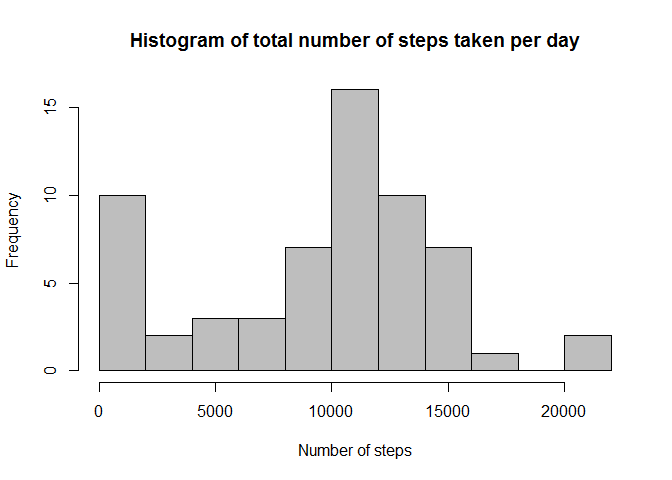
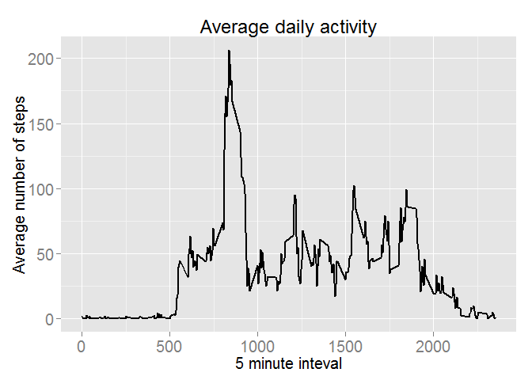
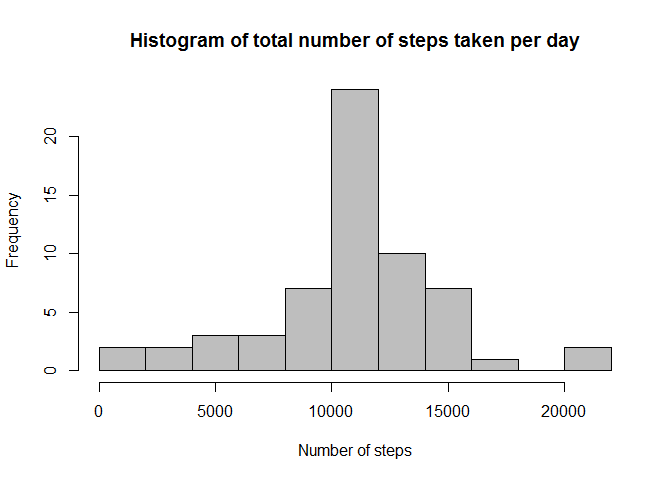
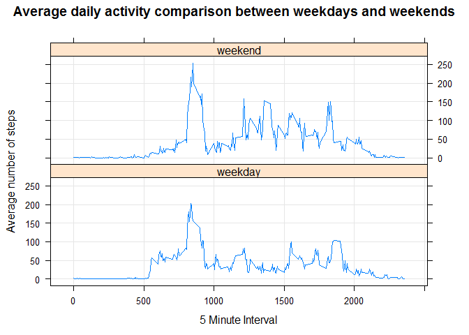

# Reproducible Research: Peer Assessment 1


## Loading and preprocessing the data


Unzip dataset if it's not done already.


```r
if(!file.exists('activity.csv')){
    unzip('activity.zip')
}
df_activity <- read.csv('activity.csv')
```
Load necessary libraries


```r
library(plyr)
library(ggplot2)
library(lubridate)
library(lattice)
```

Load data

```r
df_activity <- read.table('activity.csv', sep = ',', header = TRUE, row.names = NULL, quote = "\"",stringsAsFactors=FALSE)
```

Set option to show numbers not in scientific notation


```r
options(scipen = 999)
```

 Convert date data into date format


```r
df_activity$date <- as.Date(df_activity$date)
```

## What is mean total number of steps taken per day?

Let's calculcate total number of steps taken per day and plot the histogram. In this case we ignore NA values.


```r
df_summary <- ddply(df_activity,c('date'),summarise,sum = sum(steps, na.rm = TRUE))
hist(df_summary$sum, xlab = 'Number of steps', main = 'Histogram of total number of steps taken per day',
     breaks = 10, col = 'grey')
```

 

Now we can calcluate mean and median of total steps taken per day


```r
mean_steps_per_day <- mean(df_summary$sum)
median_steps_per_day <- median(df_summary$sum)
```

 - **Mean steps per day  9354.2295082**
 - **Median steps per day 10395 **

## What is the average daily activity pattern?

Let's calculate average steps taken for every interval. In this case we ignore NA values


```r
df_interval <- ddply(df_activity,c('interval'),summarise,mean=mean(steps, na.rm = TRUE))
```

Create time series plot

```r
ggplot(data = df_interval, aes(interval,mean)) + geom_line(size = 1) +
    labs(x= '5 minute inteval', y = 'Average number of steps', title = 'Average daily activity') +
    theme(text = element_text(size=15), axis.text = element_text(size = 15))
```

 

## Which 5-minute interval, on average across all the days in the dataset, contains the maximum number of steps?


```r
max_interval <- df_interval[which.max(df_interval$mean),]
```
**The interval 835 contains the maximum number of steps 206.1698113.**

## Imputing missing values

Let's find how many rows have NA values.

```r
count_na <- sum(is.na(df_activity))
```

There are currently 2304 rows with NA values in out data frame. Because missing values may introduce bias into calculations  NA values will be replaced by mean of the same 5-minute inteval.


```r
df_imp <- join(df_activity,df_interval, by = 'interval')
df_imp$steps_new <- df_imp$steps
df_na <- is.na(df_imp$steps)
df_imp$steps_new[df_na] <- df_imp$mean[df_na]
```

Let's have a look at the histogram of the total number of steps taken each day. Now missing values are not ignored but replaced by mean value of the same interval.


```r
df_imp_summary <- ddply(df_imp,c('date'),summarise,sum = sum(steps_new, na.rm = FALSE))
hist(df_imp_summary$sum, xlab = 'Number of steps', main = 'Histogram of total number of steps taken per day',
     breaks = 10, col = 'grey')
```

 

Now we can calcluate mean and median of total steps taken per day


```r
imp_mean_steps_per_day <- mean(df_imp_summary$sum)
imp_median_steps_per_day <- median(df_imp_summary$sum)
```

 - **Mean steps per day  10766.1886792**
 - **Median steps per day 10766.1886792 **
 
By replacing missing values we got different results for  the same calculation. Here is the comparison

With missing values | Without missing values
------------------- | -----------------------
Mean steps per day 9354.2295082| Mean steps per day 10766.1886792
Medain steps per day 10395 | Median steps per day 10766.1886792

The impact of imputing missing values was the increase in both median and mean values.

## Are there differences in activity patterns between weekdays and weekends?

Let's add new column is_weekend into data frame where missing values are replaced. This new column show is the date weekday or weekend.


```r
df_imp$weekday <- wday(df_imp$date)
df_imp$is_weekend <- ifelse (df_imp$weekday > 5,'weekend','weekday')
df_imp$weekday <- NULL
```
Make a panel plot containing a time series plot (i.e. type = "l") of the 5-minute interval (x-axis) and the average number of steps taken, averaged across all weekday days or weekend days (y-axis). 


```r
df_imputed_aggregated <- aggregate(steps_new ~ interval + is_weekend, data=df_imp, mean)

xyplot(
        steps_new ~ interval | is_weekend,
        df_imputed_aggregated,
        type = 'l',
        layout = c(1,2),
        main = 'Average daily activity comparison between weekdays and weekends',
        xlab = "5 Minute Interval",
        ylab = "Average number of steps",
        grid = TRUE
)
```

 
